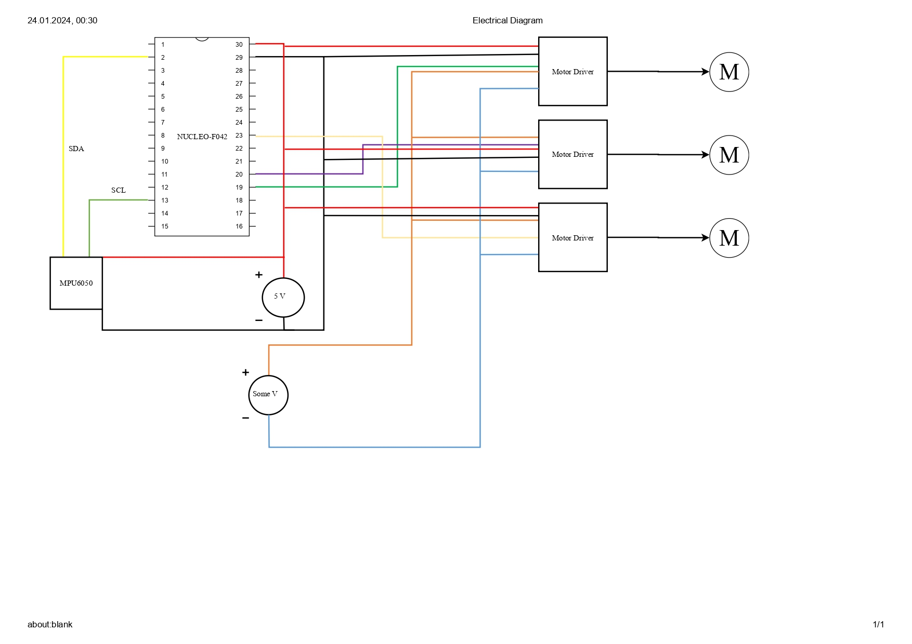

# SimpleGimbalSTM32

This repository contains the implementation of **SimpleGimbalSTM32**, a lightweight and functional gimbal control system. The project was created in 2024 as part of a Master's course project. It demonstrates the integration of the STM32 platform with a motion sensor and servomechanisms.

## Overview

**SimpleGimbalSTM32** is built around the following components:
- **Nucleo-F042K6 Development Board**: A cost-effective STM32 microcontroller platform.
- **MPU6050 Sensor**: An inertial measurement unit (IMU) combining a gyroscope and accelerometer.
- **Servomechanism**: Used to demonstrate gimbal movement and control.

The system integrates:
- Real-time data acquisition from the MPU6050 to detect motion and orientation.
- A control algorithm to drive the servomechanism and stabilize orientation.
- Electronic and software design tailored for a lightweight and educational application.

## Features

- **Sensor Integration**: Real-time IMU data processing for precise motion control.
- **Control Algorithm**: Implements stabilization for single-axis motion.
- **Hardware Demonstration**: Fully functional gimbal system using servos and the MPU6050.

## Hardware Diagram

## Getting Started

### Prerequisites

- STM32CubeIDE or another compatible development environment.
- Nucleo-F042K6 board.
- MPU6050 sensor module.
- Servo motor.

### Setup

1. Connect the MPU6050 and servo to the Nucleo-F042K6 board as per the hardware diagram.
2. Load the project files into your development environment.
3. Compile and flash the firmware onto the STM32 microcontroller.
4. Power the system and observe gimbal stabilization in action.

## Usage

- The system processes real-time orientation data from the MPU6050.
- Servo motors adjust positions to stabilize based on sensor input.

## Future Enhancements

Potential improvements include:
- Extending control to multiple axes.
- Adding advanced stabilization algorithms.
- Enhancing GUI-based control for better user interaction.

## License

This project is licensed under the MIT License. See the `LICENSE` file for details.

## Contact
For any questions or suggestions, please feel free to reach out via szymon.parol@outlook.com.

